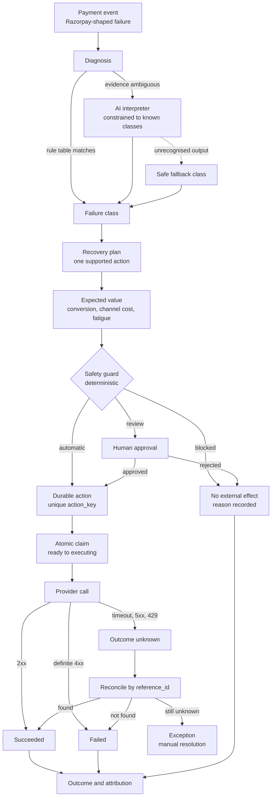
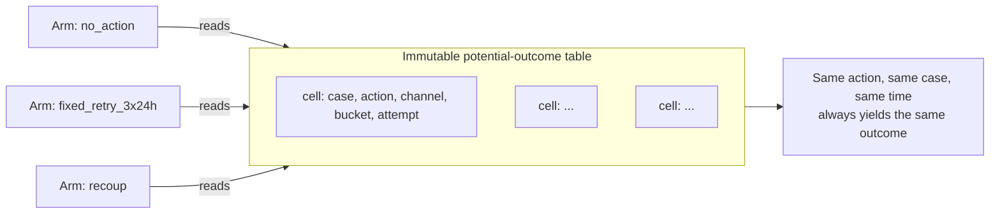
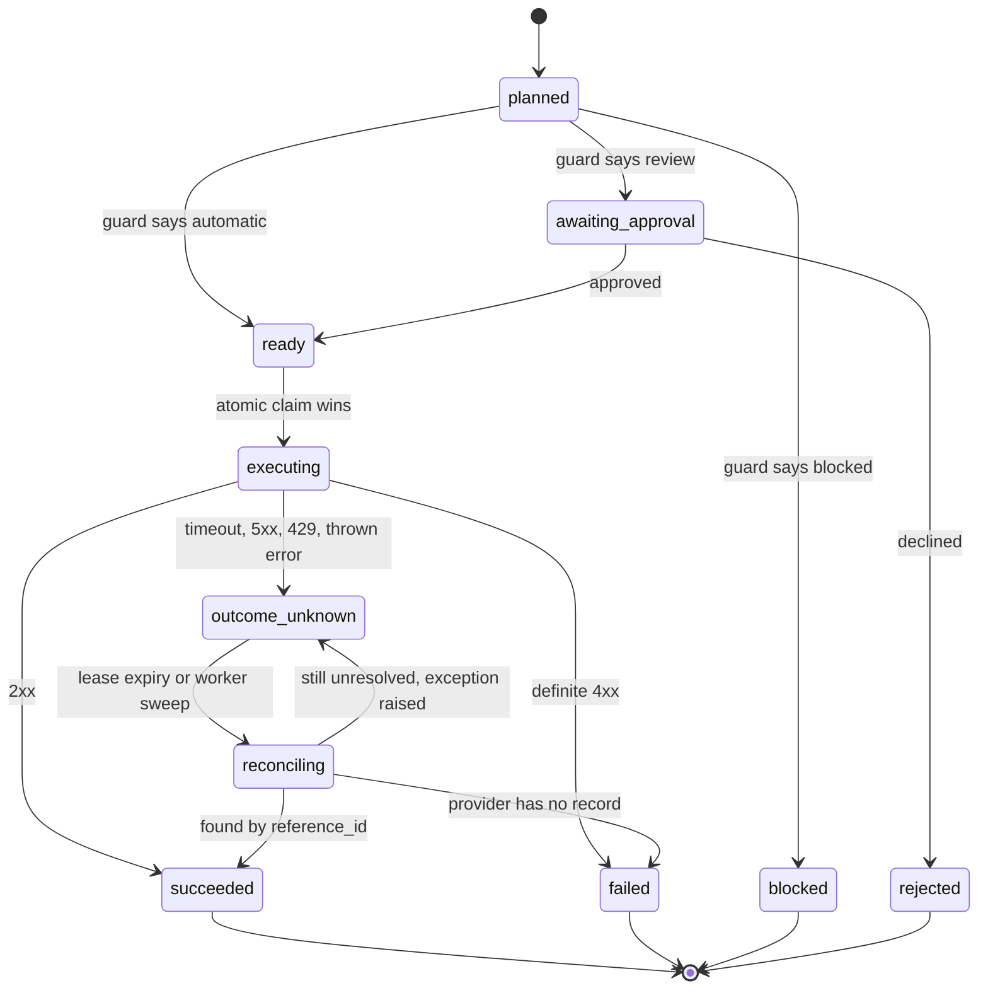
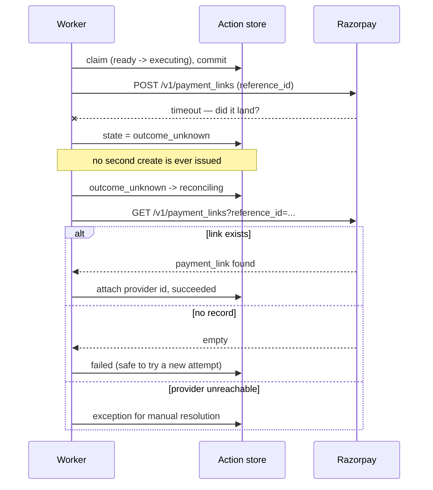
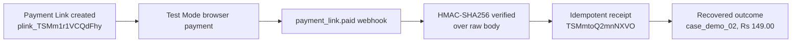

# Recoup

Recoup detects revenue at risk, chooses **one bounded recovery action**, applies deterministic
safety rules, and measures incremental recovery against shared counterfactual outcomes.

Built for the Razorpay AI Buildathon — **AI Revenue Recovery** track.

```bash
bun install
bun test          # 79 backend tests
bun run test:web  # 19 frontend tests
bun run eval      # deterministic report for the committed seed
bun run demo      # regenerate the showcase and open the Recovery Desk
```

Razorpay Test Mode (needs a gitignored `.env`) — see the
[runbook](#razorpay-test-mode-runbook):

```bash
bun run razorpay:webhook   # signed webhook listener on /webhooks/razorpay
bun run razorpay:link      # create a real Test Mode Payment Link
bun run razorpay:status    # actions, receipts, outcomes, exceptions
```

`bun run eval` is byte-identical for a fixed seed. No AI key and no external infrastructure
are needed for the evaluation or the demo.

---

## The two claims this project refuses to make

Most payment-recovery demos quietly rest on two things that are not true. Recoup is designed
around not needing either.

### 1. It does not retry arbitrary failed card payments through Razorpay

A merchant cannot silently re-charge a card that just failed. So for every ordinary card
failure Recoup creates a **new customer-initiated collection path** — a Payment Link — rather
than pretending to re-run the original charge. Recurring subscription retries are owned by
Razorpay; Recoup **observes** those transitions and decides whether a separate customer
intervention is warranted at all.

The naive "retry 3× every 24h" policy still appears in the evaluation, because it is a real
merchant policy worth beating. Its retries are **simulator events, never Razorpay API calls**.
Every action carries its execution domain so the UI can never blur the line:

| Action kind | What it means |
|---|---|
| `simulated_retry` | Simulator only. Never leaves the process. |
| `simulated_contact` | Simulated messaging ledger. No real messages are sent. |
| `razorpay_payment_link` | A real Payment Link in Razorpay Test Mode. |
| `razorpay_subscription_observation` | A Razorpay-owned retry, observed not commanded. |

### 2. It does not let evaluation arms share a random-number generator

If two arms draw from one sequential RNG, an arm that takes more actions shifts every later
draw and the comparison between them is meaningless. See [the causal model](#the-causal-model).

---

## Architecture

Recoup is a pipeline. Every stage writes an append-only record, so any case can be replayed
from evidence to outcome.



**AI is confined to one job**: interpreting ambiguous evidence into a failure class. It cannot
authorise a payment action, bypass the guard, or decide that an external effect succeeded. Its
output is validated against the known vocabulary and capped in confidence; anything
unrecognised falls back to the least aggressive class.

### Safety guard

The guard is deterministic and runs **after** all AI involvement. Rules are evaluated together;
`blocked` always beats `review`, which always beats `automatic`.

| Rule | Effect |
|---|---|
| `kill_switch` | blocked |
| `opt_out` | blocked — customer is on the suppression list |
| `fraud_diagnosis` / `fraud_risk_score` | blocked — freeze, no retry, no contact |
| `contact_cap` / `contact_spacing` | blocked |
| `negative_expected_value` | blocked |
| `elevated_risk`, `high_value`, `mandate_reauthorisation`, `low_diagnosis_confidence` | review |
| `quiet_hours` | defers the send rather than blocking it |

Approval takes time, and that wait can push an action back into quiet hours — so the timing
rule is **re-applied after approval** rather than trusting the pre-approval check.

---

## The causal model

Before any policy runs, the world is fixed. Every possible result is addressed by a key:

```
(caseId, actionKind, channel, timeBucket, attemptNumber)
        └─> draw = hash(masterSeed, ...key)  ∈ [0, 1)
```

Taking an action **reveals** a cell of this table. It never creates one and never disturbs
another cell.



The *probability* each draw is compared against depends only on the case's own immutable
latents and the components of the key — never on runtime history. That makes "adding an
unrelated action does not shift another action's outcome" true by construction rather than by
luck.

Contact fatigue is modelled the same way: each customer has a latent `fatigueTolerance`, and
the `attemptNumber` in the key decides whether an attempt crosses it. Cross-channel pressure is
a *policy* constraint enforced by the guard, not a mutation of the outcome table.

### Attribution

A recovery is credited to an action only when **all** of these hold:

- the payment falls inside that action's declared attribution window,
- the customer's organic path would **not** already have paid by then,
- no earlier eligible action owns the recovery,
- the event has not already been attributed.

Customers who would have paid anyway are never counted as incremental recovery.

### Why collecting fraud scores negative

Money collected on a fraudulent case is reversed and costs a scheme fee on top. Net value
subtracts the reversal *and* the fee, which makes "recover everything" a losing strategy and
gives the fraud block real economic weight rather than a compliance checkbox.

---

## Durable action identity

Every intended external effect gets one identity, derived **before** approval:

```
action_key = SHA-256(caseId, policyVersion, actionKind, scheduledAt, attemptNumber)
reference_id = ("rcp_" + action_key) truncated to Razorpay's 40-character limit
```

Both are unique in the database. Repeated approvals converge on one row rather than one effect
each.



`succeeded`, `failed`, `blocked` and `rejected` are terminal. A failed action is **never**
retried in place — a genuine retry uses a new attempt number and therefore a new `action_key`.

**Execution ownership** comes from a conditional `UPDATE ... WHERE state = 'ready'`, committed
*before* the provider is contacted. Only the transaction that moves the row out of `ready` may
make the call, so concurrent workers, repeated approval requests and process restarts cannot
claim the same action twice.

### Never guess after an ambiguous call

Razorpay documents API-level idempotency for **payouts**, not Payment Links. So this adapter
does not rely on an idempotency header — it leans on the unique `reference_id`.



An expired execution lease is reclaimed **only into reconciliation**, never back to `ready`,
because the provider may already have acted on the original request.

### Webhook idempotency

Deliveries are identified by `(provider, event_id)`, falling back to a hash of the verified raw
body when no stable id exists. The receipt insert and the state change commit in **one
transaction**, so a redelivery is a no-op and a crash mid-apply rolls back rather than marking
the delivery seen but unprocessed.

Signatures are verified with **HMAC-SHA256 over the untouched raw body** and a constant-time
comparison — parsing and re-serialising first would change the bytes and break verification.

---

## Razorpay Test Mode runbook

Requires a `.env` (gitignored) with `RAZORPAY_KEY_ID`, `RAZORPAY_KEY_SECRET` and
`RAZORPAY_WEBHOOK_SECRET`. The config helper **refuses any key that is not `rzp_test_`**, and a
local budget of 15 links stays under Razorpay's documented 30-link Test Mode cap. No credential
is ever logged.

**1. Start the webhook listener** (leave running):

```bash
bun run razorpay:webhook          # http://localhost:8787/webhooks/razorpay
```

**2. Expose it publicly.** Razorpay blacklists several tunnels for security — **`ngrok.io`,
`loca.lt`, `webhook.site`, `requestbin.com` and `hookbin.com` will not deliver.** Razorpay
[recommends `zrok`](https://razorpay.com/docs/webhooks/validate-test/); a staging endpoint is
safer still.

```bash
zrok share public http://127.0.0.1:8787
```

Register `<public-url>/webhooks/razorpay` in **Dashboard → Settings → Webhooks** using the same
secret as `RAZORPAY_WEBHOOK_SECRET`, subscribed to `payment_link.paid`,
`payment_link.partially_paid` and `payment_link.expired`. Test mode prompts for OTP `754081`.

> If the webhook secret is ever rotated, retries of **older** deliveries must be validated with
> the **old** secret.

**3. Create a real Payment Link** through the full production path — durable action key, atomic
claim committed before the call, reconciliation by `reference_id` if the result is ambiguous:

```bash
bun run razorpay:link                       # Rs 1,499 default
bun run razorpay:link case_demo_01 250000   # caseId, amount in paise
```

Pay the printed `short_url` with test card `4111 1111 1111 1111`, any future expiry, any CVV.

**4. Verify what actually happened:**

```bash
bun run razorpay:status   # actions, transitions, receipts, outcomes, exceptions
```

All three commands share `recoup-testmode.sqlite` in the repo root, so run them from there.

### Verified end to end in Razorpay Test Mode

The full path has been exercised against the real Razorpay API — not a mock. Run on
2026-08-21 for `case_demo_02` at ₹149.00:

```bash
bun run razorpay:webhook                      # terminal 1, listener
zrok2 share public http://127.0.0.1:8787      # terminal 2, public tunnel
bun run razorpay:link case_demo_02 14900      # terminal 3, creates the real link
bun run razorpay:status                       # read back what happened
```



| Evidence | Value |
|---|---|
| Payment Link id | `plink_TSMm1r1VCQdFhy` |
| Reference id (derived from the action key) | `rcp_fdeaab97b1f53b2ad0fc69ea245342d1b1d8` |
| Webhook receipt id | `TSMmtoQ2mnNXVO` |
| Recorded outcome | `case_demo_02` recovered **₹149.00** |
| Open exceptions | none |

Every stage succeeded: Payment Link creation, browser payment in Test Mode, signed webhook
verification, idempotent receipt, and recovery reconciliation. These are Test Mode identifiers
and contain no credential material.

The same endpoint was also rehearsed offline against a signed payload, with no Razorpay calls:

| Case | Result |
|---|---|
| Valid signature | `200 processed`, outcome recorded once |
| Same `event_id` redelivered | `200 duplicate`, no double-count |
| Tampered signature | `400`, nothing recorded |

---

## Results on the committed seed

`bun run eval`, 2000 cases, seed `recoup-buildathon-2026-v1`:

| Metric | no_action | fixed_retry_3x24h | **recoup** |
|---|---:|---:|---:|
| recovery rate | 22.3% | 31.8% | **54.9%** |
| net value | ₹29.31L | ₹42.79L | **₹75.23L** |
| actions executed | 0 | 5,108 | **1,771** |
| churn penalty | ₹0 | ₹0 | ₹8,114 |
| fraud cases untouched | 69 | 1 | **65** |

**Incremental recovery vs the fixed policy: ₹32.43L**, using roughly a third of the actions.
Diagnosis accuracy is 97.1% overall; 74.2% on the ambiguous-evidence path that reaches the AI
interpreter.

Three results worth stating plainly rather than burying:

**Naive retry beats Recoup on `issuer_down`.** When an issuer outage clears, silently
re-charging really is better than asking the customer to pay again. Recoup loses that class
*because it will not fake a retry it cannot perform*. That gap is the honest price of the
provider boundary.

**Pricing customer fatigue was the single biggest lever.** An earlier version scored conversion
and channel cost but ignored the cost of annoying someone. It bought revenue with customer
lifetime value: ₹27.7L of churn, and `invoice_overdue` scoring *worse than doing nothing*.
Charging expected relationship damage against each repeat contact cut churn to ₹8.1k and raised
net value while taking **fewer** actions.

**The fraud freeze costs real money.** About 18% of the `suspected_fraud` class is not actually
fraud, so a blanket freeze forgoes their recovery — the naive policy scores higher on that class.
That is a deliberate product decision, shown rather than hidden.

---

## Recovery Desk

A React + Framer Motion + react-three-fiber interface over the **real** audit trail — every
figure on screen is a record from `showcase.json`, generated by running the actual pipeline.

- **Runtime path** — the architecture above, rendered for one case. Attempt-aware: decisions and
  actions are matched strictly by `attemptNumber`, so a blocked attempt can never inherit
  another attempt's action. The `Card Expired` case reads honestly across both attempts —
  attempt 1 approved at EV ₹2,054 with a Payment Link that succeeded; attempt 2 **blocked** at
  EV −₹1,288 with no external action at all. That is fatigue pricing, visible.
- **Case field** — one 3D tile per real case. Colour is the case's actual status, height is its
  actual amount at risk, reconciled tiles pulse, and clicking a tile opens that case. Three.js
  is code-split behind a static fallback drawn from the same records, which also serves
  reduced-motion users.
- **Queue** — filter chips with live counts, search, and `j`/`k` navigation. "Stopped" derives
  from decision outcomes and blocking guard rules, not merely `actions.length === 0` (a case can
  settle organically before its first action was ever due).
- **Charts** — palette validated with the dataviz validator against the dark surface; bars and
  rows are focusable and expose full values via `aria-label`; tooltips fire on hover, focus and
  tap.

Simulated actions are dashed amber; Razorpay-backed actions are solid Razorpay blue. The
distinction is restated in the footer legend.

---

## Test coverage

| Suite | Tests | What it pins down |
|---|---:|---|
| `tests/counterfactual.test.ts` | 11 | Arm independence, attribution, provider boundary |
| `tests/diagnosis.test.ts` | 8 | Rule table, AI containment, safe fallback |
| `tests/guard.test.ts` | 17 | Every guard rule, quiet hours, kill switch |
| `tests/idempotency.test.ts` | 26 | Action identity, atomic claim, state machine, webhooks |
| `tests/execution.test.ts` | 17 | Adapter classification against a local mock server |
| `web/tests/ui.test.tsx` | 19 | Attempt isolation, filter semantics, tile mapping, a11y |
| **Total** | **98** | |

The Payment Link adapter is proven against a local mock server covering success, validation
failure, 5xx, rate limiting, timeout, duplicate `reference_id`, and every reconciliation
branch — so the contract holds without live keys.

---

## Repository layout

```
src/
  sim/          keyed RNG, case population, potential-outcome oracle
  domain/       core types and the CaseView a policy is allowed to see
  diagnosis/    Razorpay-shaped events, rule table, AI interpreter
  policy/       belief model, expected value, safety guard, recovery plans
  policies/     the three evaluation arms
  store/        SQLite schema, durable actions, webhook receipts
  execution/    executor interface, Razorpay adapter, simulated executors
  runtime/      the pipeline that drives store + executor end to end
  eval/         arm simulation, metrics, deterministic report
  demo/         showcase generator (asserts all five demo scenes exist)
web/            Recovery Desk
```

---

## Status

| Slice | State |
|---|---|
| 1 — shared evaluation world, keyed potential outcomes, baseline arms | **Done** |
| 2 — diagnosis, policy, safety guard | **Done** |
| 3 — durable action state, atomic claim, idempotency | **Done** |
| 4 — Recoup arm and attribution metrics | **Done** |
| 5 — Razorpay Test Mode integration and reconciliation | **Done** — verified end to end against the real API: Payment Link creation, browser payment, signed `payment_link.paid` webhook, idempotent receipt, recovered outcome. Evidence above. |
| 6 — Recovery Desk UI | **Done** |
| 7 — submission package | **Partial** — deterministic `demo` and `eval` run from a clean clone, this document is the architecture write-up, and the Test Mode proof is captured; the five-minute video is not yet recorded |

### What is genuinely not done

1. **The five-minute demo video.** Everything it needs to show now exists and is reproducible.
2. **3D tile-click interaction** is unit-tested for its case mapping but has not been verified
   by a human click in a foreground browser.
3. **Deployment.** The Recovery Desk is a static build and is not yet hosted, so there is no
   public link a reviewer can click.
4. **Webhook secret rotation.** Verification uses a single `RAZORPAY_WEBHOOK_SECRET`. Razorpay
   requires the *old* secret when retrying deliveries created before a rotation, so do not
   rotate the secret while deliveries are in flight.

---

## Honesty boundary

The effectiveness numbers are **simulated causal results from a known synthetic world**. They
demonstrate that the policy makes better decisions than the baselines *given that world*; they
are **not** production recovery rates.

Razorpay Test Mode proves integration behaviour — Payment Link creation, payment confirmation,
webhook verification, subscription-state observation — and **nothing** about effectiveness.

These two claims are kept separate everywhere: in this document, in the report, in the Desk, and
in the video.
